# TCP/IP 기초

## 01. TCP/IP의 레이어 구성

> **TCP/IP** 통신 프로토콜이다

- TCP ( Transmission Control Protocol )
- IP ( Internet Protocol )

> **OSI 참조 모델과의 비교**   
> 우선, OSI (Open System Interconnection) 참조 모델은 총 7계층으로 이루어져 있다.
> 네트워크의 표준규격을 책정한 통신 모델이지만 너무 복잡해서 보급되지 않았다.
> 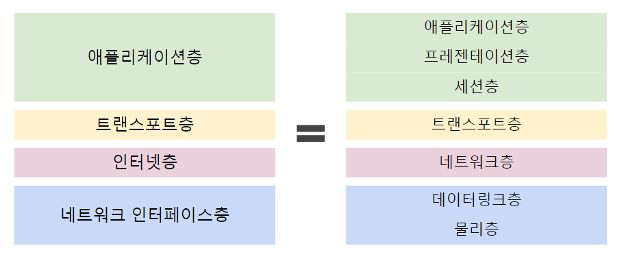   
> (TCP/IP는 OSI에 준거해서 만들어진 것이 아니므로 정확하게 1대 1로 대응하지 않음)
> 1. 물리층 : 커넥터 형상, 핀 배치 결정
> 2. 데이터링크증 : 접속 대상과 통신을 직접 구현
> 3. 네트워크층 : 중계 기능으로 무선의 상대와 통신
> 4. 트랜스포트층 : 코도의 통신 제어 기능
> 5. 세션층 : 접속 관리
> 6. 프레젠테이션층 : 표현형식 변환
> 7. 애플리케이션층 : 개별 애플리케이션의 기능 구현

---
   
   

### **TCP/IP** 는 아래와 같이 총 4개의 층으로 이루어져 있다.
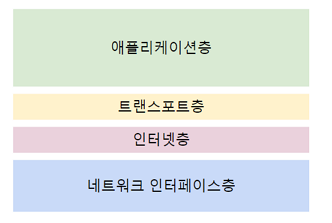   

### 1) 네트워크 인터페이스층
- 직접 연결된 상대와 통신하는 기능을 구현 (물리장치 포함)
- 주요 프로토콜 :    
  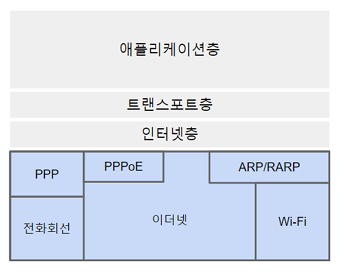
  - **이더넷(Ethernet)** : 유선 LAN에서 가장 주류인 네트워크 규격
  - **Wi-Fi** : 무선을 사용해서 LAN에 접속하기 위한 규격
  - **PPPoE(Point-to-Point Protocol over Ethernet)** :    
    이더넷을 사용해서 1대1 접속. 인터넷 접속 서비스의 이용자 인증에 사용
  - **PPP** : PPPoE를 기반으로 한 프로토콜. 전화회선을 사용해서 접속 (예전)
  - **ARP/RARP(Reverse/Address Resolution Protocol)** :    
    IP주소와 MAC주소를 교환하기 위한 프로토콜

### 2) 인터넷층
- 복수개의 네트워크를 연결해서 서로 패킷을 교환하는 기능을 구현
- 패킷 중계 기능 -> **라우팅**
- 주요 프로토콜 :   
  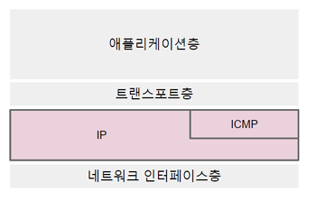
    - **IP(Internet Protocol)** : 직접 연결되어 있지 않은 네트워크간 패킷을 라우팅하는 기능을 제공
    - **ICMP** : IP의 동작을 보조. 대상에게 도달할 수 있을지 검사. 미도달 이유 통지.

### 3) 트랜스포트층
- 인터넷층에서 구현한 통신 기능으로 목적에 맞는 통신을 제어
- 주요 프로토콜 :   
  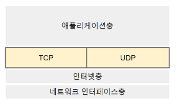
    - **TCP(transmission Control Protocol)** :    
      데이터의 확인이나 재전송, 중복 데이터 제거, 패킷 순서 변경 등을 수행.     ~~신뢰도~~가 높은 통신     
      HTTP, SMTP 등 인터넷 애플리케이션에서 폭넓게 사용    
    - **UDP(User Datagram Protocol)**  :    
      바로 사용할 수 있는 가벼운 통신 기능. 실시간 성격이 큰 통신    
      음악이나 동영상 스트리밍, 인터넷 전화 등에 사용     
      DNS나 NTP 등 서버에 빈번하게 요청하는 용도로 이용     

#### TCP에 대해서 더 알아보자!
> 1. 시퀀스 번호 : 부여된 데이터 순서의 보증(시퀀스 번호)
> 2. 오류 검증 : 수신 데이터의 오류 존재 여부에 대한 확인
> 3. 긍정 확인 응답 : 상대가 확실히 수신했는지 여부 확인
> 4. 슬라이딩 윈도우 : 수신받지 못한 데이터의 재전송 요청
> 5. 흐름 제어 : 상대의 페이스에 맞춘 데이터 전송
> 6. 혼잡 제어 : 네트워크의 혼잡 상황에 따른 송신 속도의 조정
>
> **sliding window**
> 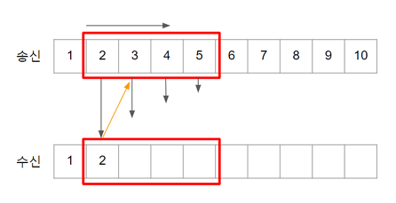
>
> **3-way handshake**
> 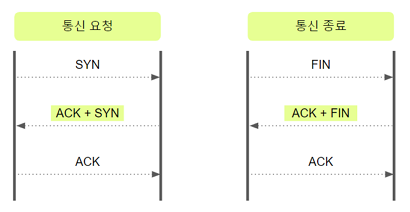   

    
### 4) 애플리케이션층
- 각 애플리케이션이 갖고 있는 구체적인 통신 서비스 구현
- 다른 층에 비해 특징이 없지만 각각의 애플리케이션이 독자적 틍징을 갖고 있음
- 주요 프로토콜 :   
  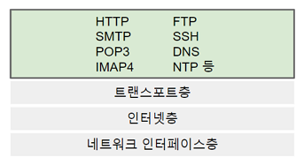
    - **HTTP** : Web에 접속하거나 모바일 애플리케이션 통신에 사용
    - **SMTP** : 메일 송신이나 서버 간의 전송
    - **POP3** : 메일함에서 메일을 꺼냄
    - **IMAP4** : 메일함의 메일을 읽음
    - **FTP** : 파일 전송 프로토콜
    - **SSH** : 문자 기반으로 서버 등에 명령하고 결과를 봄
    - **DNS** : 주소를 해석하여 도메인명과 IP 주소를 상호 변환
    - **NTP** : 네트워크 시간 동기화

## 02. 레이어별 처리와 패킷
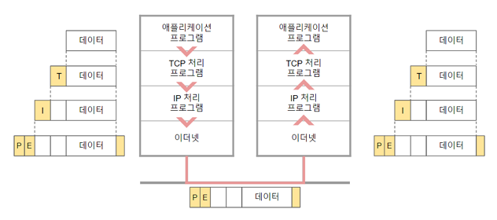
- 전송층 : 상위층으로 부터 받은 데이터에 ~~헤더 추가~~
- 수신층 : 하위층으로 부터 받은 데이터에서 ~~헤더 삭제~~

## 03. IP 주소
- 각 컴퓨터를 식별하기 위해 컴퓨터에 부여된 번호
    1. **ICANN** (Internet Corportion for Assigned Names and Numbers)
    2. **APNIC** : 지역인터넷 레지스트리
    3. **KRNIC** : 국가별 인터넷 레지스트리
    4. **ISP** 등 : 로컬 인터넷 레지스트리

### 사설 IP주소
- 조직이나 가정 등의 내부 네트워크에서 사용
- 다른 조직과 사설 IP 주소가 중복되더라도 전혀 상관없음

### 클래스

|클래스| IP 주소 범위 | 네트워크 개수 | 구별가능한 컴퓨터 대수|
|---|---|---|---|
|A Class|10.0.0.0 ~ 10.255.255.255 | 128개 | 16,777,214대|
|B Class|172.16.0.0 ~ 172.31.255.255 | 16,384개 | 65,534대|
|C Class|192.168.0.0 ~ 192.168.255.255 | 2,097,154개 | 254대|

- IP주소는 **네트워크부**와 **호스트부**로 이루어져 있다
- **클래스** : 한 개의 네트워크 주소 안에서 몇 대의 컴퓨터를 구별할 수 있는지   
    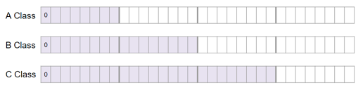

### 넷마스크
- 네트워크부의 비트를 1로 채운 상태
- 네트워크 주소를 추출하기 위해 사용 (AND 연산 이용)
  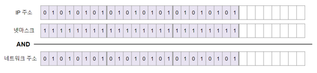

### IPv6
- IPv4로 식별할 수 있는 단말 수 : 약 43억
- IPv6로 식별할 수 있는 단말 수 : 약 340간

### 서브넷 (subnet)
- 한 개의 네트워크를 여러 개의 서브넷으로 분할하는 것
- 호스트부의 일부를 네트워크부로 연장해서 작은 네트워크로 나눔
- 네트워크부가 연장되므로 서브넷마스크도 연장

### 브로드캐스트 (ARP, DHCP)
- 유니캐스트 : 1대1 통신
- 브로드캐스트 : 동일 이더넷에 접속한 컴퓨터 전체로 데이터를 보내는 통신
- **255.255.255.255(limited broadcast address)** 혹은    
  **호스트부를 1로만든 주소(directed broadcast address)**로 패킷 전송

### 멀티캐스트
- 특정 그룹에 포함된 특정 컴퓨터에 한정해서 데이터 전송
- 클래스 D (224.0.0.0 ~ 239.255.255.255)의 주소 사용

## 04. PORT 번호
- ~~트랜스포트~~층에서 어떤 기능을 사용할 것인지 지정

### well-known port   

|포트번호|프로토콜|주요 용도|
|---|---|---|
|80|HTTP|Web접속|
|443|HTTPS|암호화(SSL)된 Web 접속|
|110|POP3|메일함 읽기|
|143|IMAP4|메일함 접속|
|25|SMTP|서버 간의 메일 전송|
|587|SMTP submission|컴퓨터에서 메일서버로 메일 전송|
|20|FTP data|파일 전송(데이터)|
|21|FTP control|파일 전송(제어)|

## 05. 연결 기기

### 1. 이더넷 관련 ( 허브 / 스위치 )
- **물리층** 과 **데이터링크층**의 프로토콜
- **허브** : 데이터 전송 기능만
- **스위치**: 데이터 전송 기능 + **VLAN기능** + **각종 관리 기능**
- 네트워크를 연결해서 한 개의 이더넷인 것처럼 동작 (확장)

### 2. 네트워크 관련 ( 라우터 )
- **네트워크층**의 프로토콜인 IP로 IP패킷을 전송
- 독립되어 있는 이더넷 네트워크 간 패킷을 중계하는 것
- 라우터로 두 네트워크를 연결 시 이더넷 환경만으로는 통신 불가
