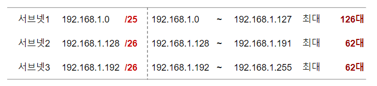
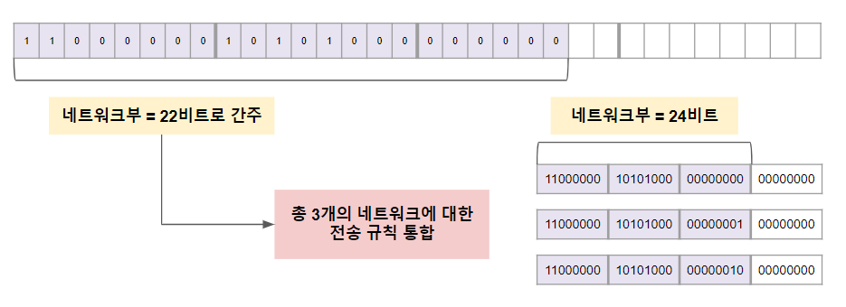
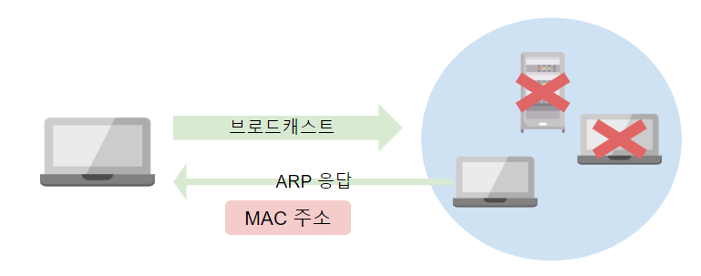
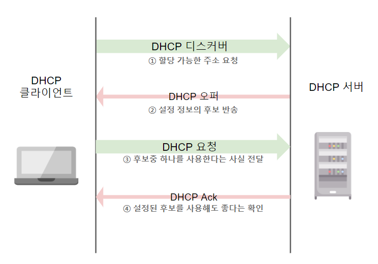

# TCP/IP 통신구조

## 01. 가변길이 서브넷 마스크와 CIDR

### 1. 가변길이 서브넷 마스크
- **고정길이 서브넷 마스크**로는 컴퓨터 수가 동일하게 구성
- 서브넷별로 컴퓨터 수를 유연하게 설정하기 위해 ~~가변길이~~ 서브넷 마스크 사용

### 2. CIDR ( Classless Inter-Domain Routing )
- 가변길이 서브넷 마스크를 기반으로 하는 기술
- 네트워크 마스크를 짧다고 간주해서 여러 개의 네트워크에 대한 전송 규칙을 통합하는 기술

## 02. MAC 주소 ( Media Access Control address )
: 이더넷 등의 네트워크 하드웨어에 할당되어 있는 주소   

### 1. ARP ( Address Resolution Protocol )
- TCP/IP 통신에서는 대상을 지정할 때 IP 주소를 사용한다.
> 1. IP 패킷을 전송하기 위해 IP 주소 내의 **네트워크 주소** 확인
> 2. 전송처의 네트워크 주소가 자신의 것과 동일하면 동일 네트워크라고 간주   
    (물리적으로 이더넷에 연결) 
> 3. IP 주소에서 MAC 주소를 도출하는 동작 수행
> 4. 다른 네트워크에 있다고 판단될 경우 IP 패킷을 라우터로 넘김
> 5. 라우터의 IP 주소에서 MAC 주소를 도출 (~~ARP 사용~~)
> 6. ARP로 MAC주소 얻은 후 지정된 이더넷 프레임을 사용해 대상 컴퓨터로 보냄

- ARP 요청은 브로드캐스트로 전송

### 2. 도메인명
- 네트워크 상의 컴퓨터 명칭
- **ICANN**에서 최상위 도메인 관리

## 03. 라우팅
: 라우터로 패킷을 전송하는 것

### 1. 라우팅 테이블
- 라우터는 패킷을 받으면 수신처의 IP 주소에서 네트워크 주소를 추출
- 라우팅 데이터블에서 그 네트워크에 간한 규칙을 찾고 그에 따라 전송
- **기본 게이트웨이**
  - 전송처를 정확히 모를 때 우선 전송해두는 기본 경로

### 2. 정적 라우팅
- 고정된 라우팅 테이블을 사용해서 라우팅하는 경우
- 네트워크 전체의 규모가 작을 때나 구성 변경이 없는 경우에 간단히 쓰는 방법
- 네트워크 구성이 변할 경우 **수동**으로 관리 필요

### 3. 동적 라우팅
- 네트워크의 접속 라우터에 관한 정보를 라우터끼리 정기적 혹은 필요에 따라 서로 교환하여 이를 기반으로 라우팅 테이블을 자동 관리하는 방법
- 신규 네트워크 연결 시 그 네트워크의 접점이 되는 라우터가 인접한 라우터로 새로운 정보를 전달하면서 **자동 확산**시키면서 라우팅 테이블 업데이트

> **라우팅 프로토콜**
> 1. 라우터끼리 경로 정보를 교환한다.
> 2. 수집한 경로 정보에서 최적 경로를 골라낸다.
>
>**AS(Autonomous System)**
> - 한 개의 ISP 또는 한 대기업이 담당하는 대규모 네트워크   
>
>**IGP(Interior Gateway Protocol)**
> - AS 내의 경로 정보를 교환
> - RIP/RIP2 (Routing Information Protocol)
>    - 소규모 네트워크에 이용
>    - 구입이나 운영이 간단함
>    - 변경을 반영하는데 시간이 걸리며 경로 선택 시 통신 속도 고려 X
> - OSPF(Open Shortest Path First)
>   - 중규모 이상의 네트워크에 사용
>   - 구입이나 운영에 걸리는 공수가 늘어나고 저렴한 기기도 대응 불가   
>
>**EGP(Exterior Gateway Protocol)**
> - AS 끼리 경로 정보 교환
> - BGP (Border Gateway Protocol)
>   - 도중에 통과하는 AS의 정보 등을 기반으로 최적 경로를 선택

## 04. DHCP 서버(Dynamic Host Configuration Protocol)
- 네트워크에 접속되어 있는 컴퓨터에 대해 필요한 네트워크 설정 정보를 자동 배포하기 위한 구조
- 아직 컴퓨터에 IP 주소 등의 네트워크 설정이 되어 있지 않은 시점에서 사용

## 05. NAT 와 NAPT

### 1) NAT (Network Address Translation)
- LAN 내의 컴퓨터가 인터넷 접속 시 라우터에 할당된 **전역 IP 주소**를 통해 통신
- LAN 내에서 인터넷에 IP 패킷을 전송할 때 사설 IP 주소를 전역 IP 주소로 교체
- 인터넷 동시 접속 컴퓨터 대수 = **라우터가 갖고 있는 전역 IP주소의 수**

### 2) NAPT (Network Address Port Translation)
- IP 주소의 변환과 동시에 **포트 번호**도 변환하는 것
- 한 개의 전역 IP 주소를 여러 대의 컴퓨터에서 공용으로 사용 가능
- 인터넷 송출 시 **라우터의 전역 IP 주소**와 **라우터가 관리하는 port 번호**로 변환
- 라우터가 한 개의 전역 IP 주소만 갖고 있어도 여러 대의 컴퓨터와 통신 가능

