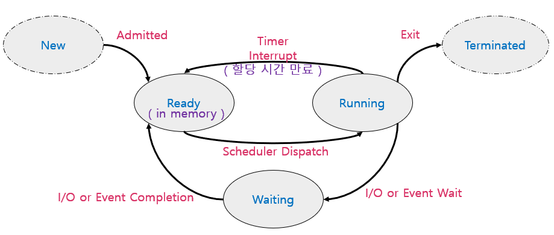
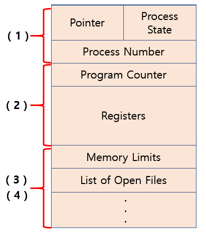
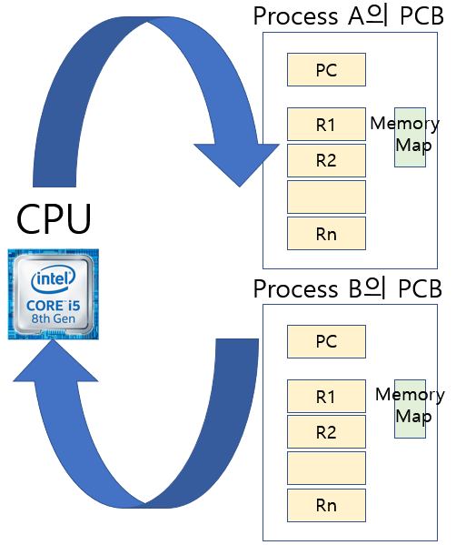
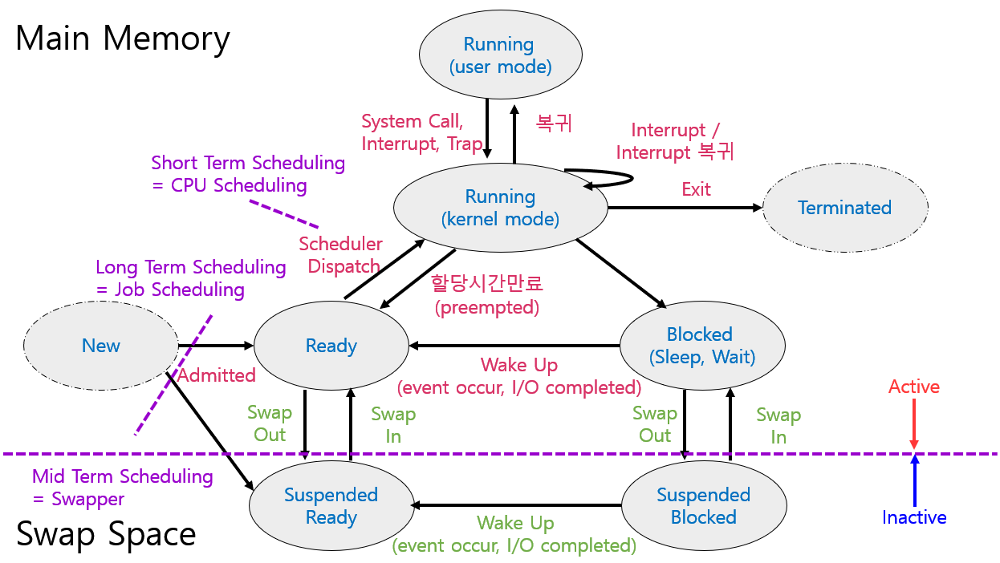

# 1. 프로세스의 개념
> Process is a program in execution

- 프로세스의 문맥(Context)
  - CPU 수행 상태를 나타내는 하드웨어 문맥
    - Program Counter
    - 각종 Registers
  - 프로세스의 주소 공간
    - code, data, stack
  - 프로세스 관련 커널 자료 구조
    - PCB ( Process Control Block )
    - Kernel Stack

- **Context** : 프로그램이 태어나서 종료될때까지 흐름에서 어느 시점을 딱 잘랐을 때,    
이 프로그램이 무엇을 어떻게 실행했는지, 현재 시점이 어떤 상태인지 정확하게 나타낼때 사용함.   
***=> 이 프로세스의 현재 상태를 보여준다.***

cf)
프로세스가 실행되면 그 프로세스만의 독자적인 공간을 갖게 되고   
CPU를 갖게 되면 PC(Program Counter)가 그 프로세스 Code의 어느 한 부분을 가르키게 된다.   
그러면 매순간 Instruction 기계어를 하나씩 읽어서 CPU안으로 불러들이고 ALU를 통해 연산을 해서
Register에 저장하거나 Memory에 저장.      

이 프로세스의 현재 상태를 나타내기 위한 정보들  :  
① **Code**의 어느 부분까지 실행했는가? = 프로그램 카운터를 보면 알 수 있다.    
Code를 한줄한줄 실행하면서 어떤 내용이 존재했으면 ② **Stack**에 내용이 쌓여 있을  것.   
③ **Data** 지금 변수의 값은 무엇인가?   

프로세스 현재상태를 알기위해선    
CPU, 메모리 상태, 운영체제가 그 프로세스에 대해서 어떤 값을 가지고 있느냐가 중요.   

- Kernel Stack도 필요한 이유?   
-> 사용자 프로그램이 실행중...   
-> PC는 사용자 프로그램의 Code를 가르키고 있다.   
-> 그러던 중 I/O 작업등의 System call이 일어나면 PC는 운영체제의 Code를 가르킨다.    
프로세스마다 별도로 구분해서 관리한다.    

==> 이런게 왜 필요한가?   
프로세스가 하나만 있으면 상관없지만,     
현대는 Time Sharing으로 여러 프로세스가 CPU를 공유해서 쓴다.  
내용을 백업해둬야 CPU를 줬다가 다시 받았을때, 처음이 아닌 다음 Instruction을 실행 할 수 있다.

# 2. 프로세스의 상태 (Process State)
> 프로세스는 상태(state)가 변경되며 수행된다.

- **Running** : CPU를 잡고 Instruction을 수행중인 상태.
- **Ready** : CPU를 기다리는 상태.( 메모리 등 다른 조건을 모두 만족 )
- **Blocked(Wait,Sleep)** : CPU를 주어도 당장 Instruction을 수행할 수 없는 상태.
- **New** : 프로세스가 생성중인 상태.
- **Terminated** : 수행이 끝난 상태.

# 3. Process Control Block (PCB)
> 운영체제가 각 프로세스를 관리하기 위해 프로세스당 유지하는 정보.

- (1) : OS가 관리상 사용하는 정보
  - Process State, Process ID,
  - Scheduling Information(우선순위 등), Priority
- (2) : CPU 수행 관련 하드웨어 값
  - Program Counter, Registers
- (3) : 메모리 관련
  - Code, Data, Stack의 위치 정보
- (4) : 파일관련
  - Open File Descriptors...

# 4. 문맥 교환 (Context Switch)
> CPU를 한 프로세스에서 다른 프로세스로 넘겨주는 과정.    
=> 하나의 사용자 프로세스로부터 또 다른 사용자 프로세스로 CPU가 넘어가는 과정

### * CPU가 다른 프로세스에게 넘어갈 때 운영체제 수행 단계

① CPU를 내어주는 프로세스의 상태를 그 프로세스의 PCB에 저장.    
② CPU를 새롭게 얻는 프로세스의 상태를 PCB에서 읽어옴.

### * System Call 이나 Interrupt 발생시 반드시 Context Switch가 일어나는 것은 아니다!

(1)의 경우에도 CPU 수행 정보 등 Context의 일부를 PCB에 저장해야 하지만 문맥교환을 하는 (2)의 경우 그 부담이 훨씬 크다.    

cf) 사용자 프로세스로부터 운영체제에게 CPU가 넘어가는 것은 Context Switch 아님!  

# 5. 스케줄러 (Scheduler)
- **Long-Term Scheduler (=장기 스케줄러,Job Scheduler**)
  - 시작 프로세스 중 어떤 것들을 Ready Queue로 보낼지 결정.
  - 프로세스에 Memory(및 각종 자원)을 주는 문제.
  - <u>degree of MultiProgramming을 제어.</u>
  - Time Sharing System에는 보통 장기 스케줄러가 없음.(무조건 Ready)

- **Short-Term Scheduler (=단기 스케줄러, CPU Scheduler)**
  - 어떤 프로세스를 다음번에 Running시킬지 결정.
  - 프로세스에 CPU를 주는 문제.
  - 충분히 빨라야함.(millisecond 단위)

- **Medium-Term Scheduler (=중기 스케줄러, Swapper)**
  - 여유 공간 마련을 위해 프로세스를 통째로 메모리에서 디스크로 쫓아냄.
  - 프로세스에게서 Memory를 뺏는 문제.
  - <u>degree of MultiProgramming을 제어</u>

=> 현대의 컴퓨터는 실행시키면 전부 메모리에 올린다.     
( ex. 100개 실행 시 100개 전부 ready 상태가 됨 )    
그러면 degree of Multiprogramming을 어떻게 조정하나?   
=> 중기스케줄러로 사용한다!

\* degree of Multiprogramming : 메모리에 올라가는 프로그램의 수

# 6. 프로세스의 상태(Process State) - 추가설명
- **Running** : CPU를 잡고 Instruction을 수행중인 상태.
- **Ready** : CPU를 기다리는 상태.(메모리 등 다른 조건을 모두 만족)
- **Blocked(Wait,Sleep)** : I/O 등의 Event를 (스스로) 기다리는 상태.
- **Suspended(Stopped)** : 외부적인 이유로 프로세스의 수행이 정지된 상태.   
프로세스는 통째로 디스크에 swap out된다.

***Blocked : 자신이 요청한 Event가 만족되는 Ready.***    
***Suspended : 외부에서 Resume해 주어야 Active.***

=> 중기스케줄러에 의해 메모리에서 쫒겨낸 애들을 표현하기 위한 Suspended를 사용.( 디스크로 SWAP OUT)   
외부에서 정지시켜 놨기 때문에 외부에서 재개를 시켜줘야 Active가 될 수 있다.

cf) User Mode에서 실행하다가 System Call 같은 Interrupt에 의해 운영체제에게 CPU가 넘어갔을 때,    
이를 운영체제 커널이 Running하고 있다고 표시하지 않는다.  
'그 사용자 프로세스가 커널모드에서 Running하고 있다' 라고 표현한다.

 

## 작성자

