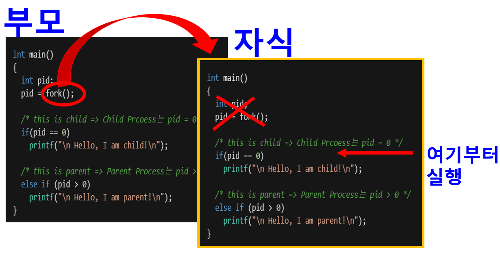
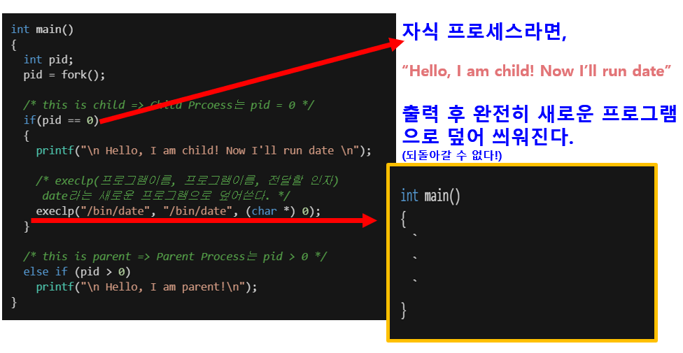
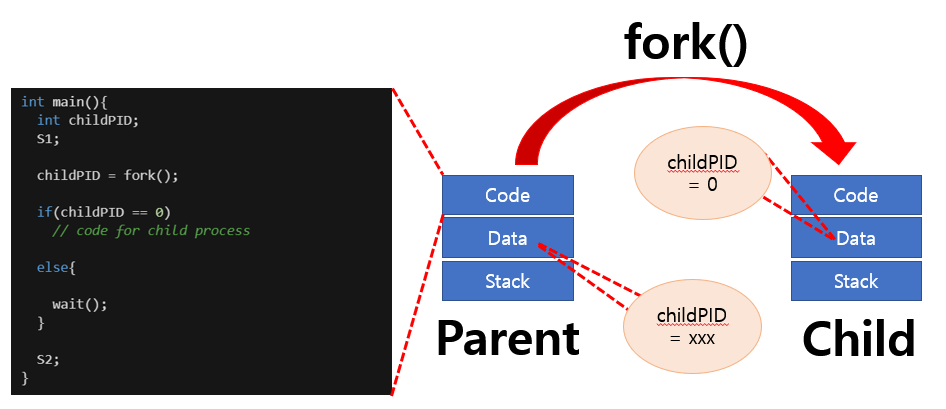
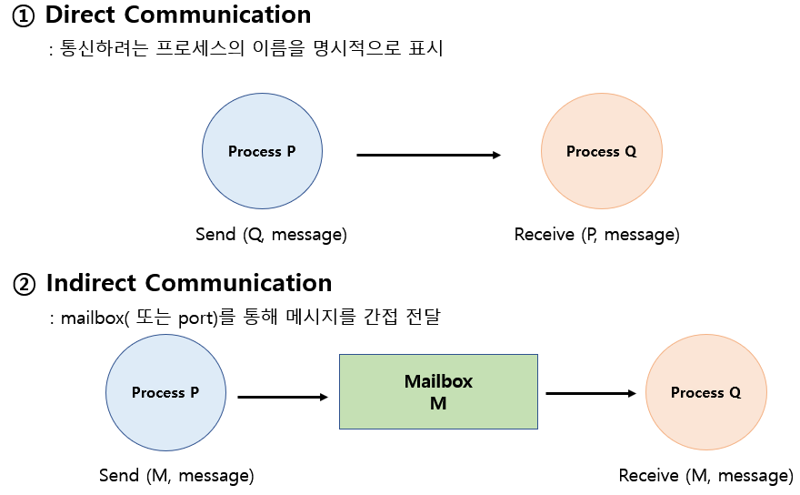
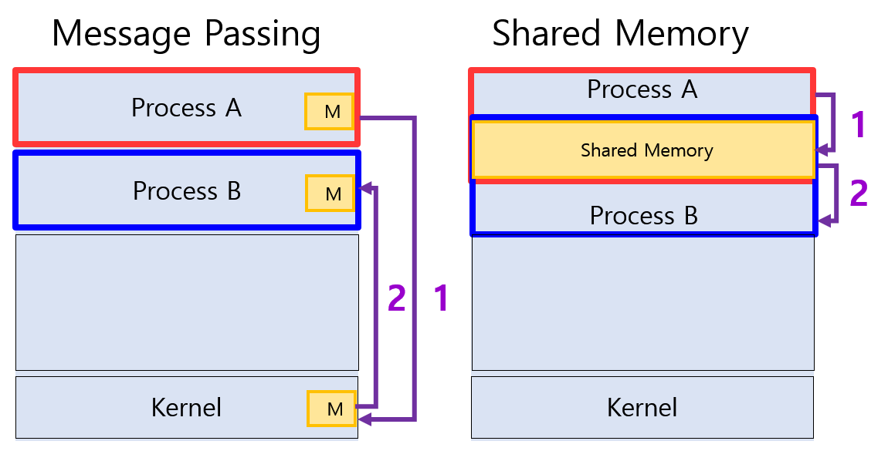

# 1.프로세스 생성(Process Creation)
> **부모 프로세스(Parent Process)가 자식 프로세스(Child Process)를 생성**

- 프로세스의 트리(계층 구조) 형성
- 프로세스는 자원을 필요로 함
  - 운영체제로부터 받는다.
  - 부모와 공유한다.
- 자원의 공유
  - 부모와 자식이 모든 자원을 공유하는 모델
  - 일부를 공유하는 모델
  - 전혀 공유하지 않는 모델
- 수행(Execution)
  - 부모와 자식은 공존하며 수행되는 모델
  - **자식이 종료(Terminate)될 때까지 부모가 기다리는(Wait) 모델**
- 주소 공간(Address Space)
  - 자식은 부모의 공간을 복사함(Binary and OS data)
  - 자식은 그 공간에 새로운 프로그램을 올림
- 유닉스의 예
  - **fork() 시스템 콜이 새로운 프로세스를 생성**
    - **부모를 그대로 복사(OS data except PID + Binary)**
    - **주소 공간 할당**
  - **fork 다음에 이어지는 exec() 시스템 콜을 통해 새로운 프로그램을 메모리에 올림**

>**Copy-On-Write(COW)**     
부모 프로세스를 복사하여 자식 프로세스를 생성했을 때,     
부모 프로세스를 그대로 복사하여 생성하면 메모리가 낭비되므로 초기에는 PC(Program Counter)만 복사하여 같은 곳을 바라보게한다. (부모와 자식이 자원을 공유)     
그 이후 부모와 달라지는 부분이 생기면 그때서 새로 생성해서 사용한다.

# 2. 프로세스 종료(Process Termination)
- **프로세스가 마지막 명령을 수행한 후 운영체제에게 이를 알려줌(exit)**
  - 자식이 부모에게 output data를 보냄 (via **wait**)
  - 프로세스의 각종 자원들이 운영체제에게 반납됨.
- 부모 프로세스가 자식의 수행을 종료 시킴(**abort**)
  - 자식이 할당 자원의 한계치를 넘어섬
  - 자식에게 할당된 태스크가 더 이상 필요하지 않음
  - 부모가 종료(exit)하는 경우
    - **운영체제는 부모 프로세스가 종료하는 경우 자식이 더 이상 수행되도록 두지 않는다.**
    - 단계적인 종료

# 3. 프로세스와 관련된 System Call 
- **fork()** : 부모 프로세스 복제하여 자식 프로세스 생성.     
- **exec()** : 새로운 프로그램으로 덮어 씌움.    
- **wait()** : block 상태로 보낸다. ready 상태로 깨운다.    
- **exit()** : 프로세스를 종료시킨다.   

## 1) fork() 시스템 콜
> fork() 시스템 콜에 의해 프로세스가 생성된다.    

```C
int main()
{
  int pid;
  pid = fork();

  /* this is child => Child Prcoess는 pid = 0 */
  if(pid == 0) 
    printf("\n Hello, I am child!\n");
  
  /* this is parent => Parent Process는 pid > 0 */
  else if (pid > 0) 
    printf("\n Hello, I am parent!\n");
}
```



순차적으로 실행 도중 fork()를 만나게 되면 새로운 프로세스를 생성한다.   
자식 프로세스는 PC에 의해 fork 생성 다음 줄 부터 실행하게 된다.   

\* 문제점?
1. 복제하면 누가 원본인가?    
=> fork 함수의 리턴 value 값으로 구분이 가능!        
**부모 프로세스는 양수 (자식 프로세스의 pid를 얻는다.)**   
**자식 프로세스는 0**   
결국, 누가 원본인지 알 수 있다.

2. 내용이 똑같으므로 똑같은 제어흐름을 따라가는가?    
=> pid의 값을 가지고 제어 흐름을 다르게 설정할 수 있다.

## 2) exec() 시스템 콜
> exec() 시스템 콜에 의해 다른 프로그램을 실행할 수 있다.

```C
int main()
{
  int pid;
  pid = fork();

  /* this is child => Child Prcoess는 pid = 0 */
  if(pid == 0) 
  {
    printf("\n Hello, I am child! Now I'll run date \n");

    /* execlp(프로그램이름, 프로그램이름, 전달할 인자)
     date라는 새로운 프로그램으로 덮어쓴다. */
    execlp("/bin/date", "/bin/date", (char *) 0);
  }

  /* this is parent => Parent Process는 pid > 0 */
  else if (pid > 0) 
    printf("\n Hello, I am parent!\n");
}
```



ex) 
prinf("1");   
execlp("echo","echo","hello","3",(char*) 0);    
printf("2");    
실행시 => 화면에 1이 출력되고  hello3 출력이 되고 종료됨.   

## 3) wait() 시스템 콜
> 프로세스 A가 wait() 시스템 콜을 호출하면,    
**커널은 child가 종료될 때까지 프로세스 A를 sleep 시킨다. (block 상태)   
Child Process가 종료되면 커널은 프로세스 A를 깨운다. (ready 상태)**



부모 프로세스가 자식 프로세스 종료되길 기다릴때 사용한다.    
자식 프로세스가 종료되길 기다리면서 부모 프로세스는 block 상태가 되고,    
자식 프로세스가 종료되면 부모 프로세스는 ready 상태가 된다.   

## 4) exit() 시스템 콜
> 프로세스를 종료시킨다.

- 자발적 종료   
  마지막 statement 수행 후 exit() 시스템 콜을 통해    
  프로그램에 명시적으로 적어주지 않아도 main 함수가   
  리턴되는 위치에 컴파일러가 자동으로 넣어준다.
- 비자발적 종료
  - 부모 프로세스가 자식 프로세스를 강제 종료 시킴.
    - 자식 프로세스가 한계치를 넘어서는 자원 요청 시
    - 자식에게 할당된 태스크가 더 이상 필요하지 않을 시
  - 키보드로 kill, break 등을 입력한 경우
  - 부모가 종료하는 경우    
  부모 프로세스가 종료하기 전에 자식들이 먼저 종료된다.

# 4. 프로세스 간 협력 (=통신)
- **독립적 프로세스(Independent Process)**    
  프로세스는 각자의 주소 공간을 가지고 수행되므로 원친적으로    
  하나의 프로세스는 다른 프로세스의 수행에 영향을 미치지 못함.

- **협력 프로세스(Cooperating Process)**    
  프로세스 협력 메커니즘을 통해 하나의 프로세스가 다른 프로세스의   
  수행에 영향을 미칠 수 있음.

- **프로세스 간 협력 메커니즘 (=IPC : InterProcess Communication)**
  - 메시지를 전달하는 방법
    - **Message Passing : 커널을 통해 메시지 전달**
  - 주소 공간을 공유하는 방법
    - **Shared Memory : 서로 다른 프로세스 간에도 일부 주소 공간을 공유**

cf) Thread는 사실상 하나의 프로세스이므로 프로세스 간 협력으로 보기는   
어렵지만 동일한 Process를 구성하는 Thread들 간에는 주소 공간을 공유하므로   
협력이 가능하다.

## 1) Message Passing
> 프로세스 사이에 공유 변수(Shared Variable)를 일체 사용하지 않고   
통신하는 시스템



## 2) Shared Memory
> 일부 주소 공간을 두 프로세스가 공유하는 방식.   
처음에 Shared Memory를 쓰기 위해 커널에게 요청, 그 이후는 프로세스 끼리 통신    
따라서 두 프로세스는 신뢰할 수 있는 관계에 있는 것이 중요하다.

## Message Passing VS Shared Memory
