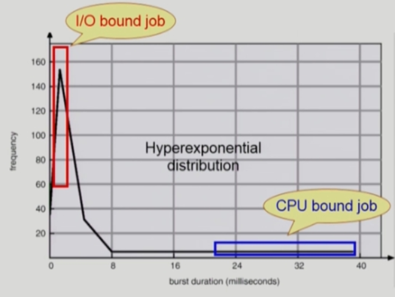
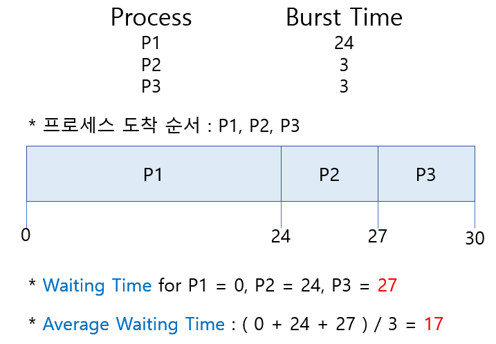
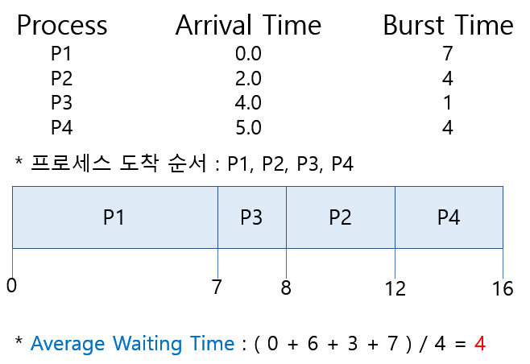
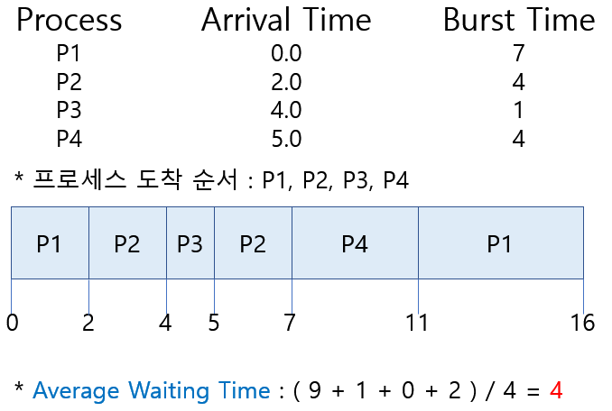
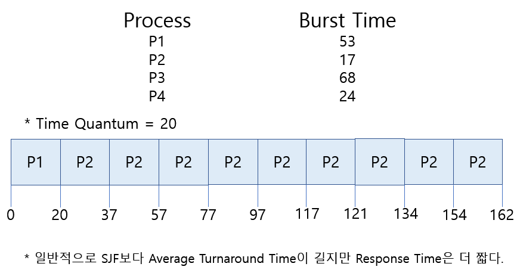

# 1. CPU and I/O Bursts in Program Execution
> CPU burst 와 I/O Burst가 반복적으로 일어난다.

- I/O-bound process
  - CPU를 잡고 계산하는 시간보다 I/O에 많은 시간이 필요한 job
  - many short CPU bursts
- CPU-bound process
  - 계산 위주의 job
  - few very long CPU bursts  

I/O bound job은 사용자와 interactive한 작업을 하는데     
cpu를 오랫동안 잡지 못하면 사람이 답답해할 수 있다.   
=> 따라서 CPU Scheduling이 중요하다.    

# 2. CPU Scheduler & Dispatcher
- **CPU Scheduler**   
  **: Ready 상태의 프로세스 중에서 이번에 CPU를 줄 프로세스를 고른다.**
- **Dispatcher**    
  **: CPU의 제어권을 CPU Scheduler에 의해 선택된 프로세스에게 넘긴다.**   
  (= **Context Switch**)

\* CPU 스케줄링이 필요한 경우?
1. Running -> Blocked (ex. I/O 요청하는 시스템 콜)
2. Running -> Ready (ex. 할당한 시간만료 =timer interrupt)
3. Blocked -> Ready (ex. I/O 완료 후 인터럽트)
4. Terminate

Non-Preemptive(= 비선점 : 강제로 뺏지 않고 자진 반납) : 1,4   
Preemptive(= 선점 : 강제로 뺏음) : 2,3

# 3. Scheduling Criteria (성능 척도)
1. 시스템 입장에서의 성능척도   
: CPU 하나 가지고 최대한 일을 많이 시키는 것.
  - **CPU Utilization(이용률)**     
  : 전체 시간에서 CPU가 놀지 않고 일한 시간의 비율
  - **Throughput(처리량)**    
  : 주어진 시간동안 몇 개의 일을 완료했는가
2. 프로그램 입장에서의 성능척도   
: 내가 빨리 CPU를 얻어서 빨리 끝내는 것.
  - **Turnaround Time(소요시간, 반환 시간)**    
  : CPU를 쓰러 들어와서 다쓰고 나가는 데까지 걸리는 시간(기다린 시간 포함)
  - **Waiting Time(대기 시간)**   
  : CPU를 쓰기 위해 기다리는 시간(순수하게 기다린 시간)
  - **Response Time(응답 시간)**    
  : 처음으로 CPU를 얻기까지 걸린 시간

cf) 선점일 경우 완료될때 까지 CPU를 쓰는 것이 아니라 계속해서 얻었다 뺐겼다 반복.   
그러면서 총 기다린 시간 = Waiting Time,   
맨 처음 기다린 시간 = Response Time

# 4. Scheduling Algorithms

## 1) FCFS (First-Come First-Served)
> 먼저 온 순서대로 처리한다. **비선점 스케줄링**

cf) Convoy Effect : 긴 프로세스가 먼저 오는 바람에 짧은 프로세스들이    
실행 되지 못하고 오래 기다리게 되는 현상을 의미한다.

## 2) SJF (Shortest-Job-First == 선점일때 : SRTF)
> CPU 작업시간이 짧은 프로세스한테 먼저 CPU를 할당한다. **비선점,선점 스케줄링**

- **Nonpreemptive(비선점)**   
: 일단 CPU를 잡으면 이번 CPU Burst가 완료될 때까지 CPU를 선점 당하지 않음.
- **Preemptive(선점)**    
: 현재 수행중인 프로세스의 남은 Burst Time보다 더 짧은 CPU Burst Time을   
가지는 새로운 프로세스가 도착하면 CPU를 빼앗김.   
**Shortest-Remaining-Time-First(SRTF)라고 부른다.**

### ① 비선점 SJF
> 지금 기다리는 프로세스들 중 제일 짧은 프로세스한테 할당.    
도중에 짧은 다른 프로세스가 들어오더라도 그대로 진행.

### ② 선점 SJF = SRTF
> 지금 기다리는 프로세스들 중 제일 짧은 프로세스한테 할당.    
도중에 들어온 프로세스가 더 짧다면 CPU를 뺏는다.

=> 선점 SJF는 Average Waiting Time을 최소화하는 알고리즘이다.

\* 문제점?
1. Starvation(기아상태) : CPU 사용시간이 긴 프로세스는 영원히 못 받을 수 있다.
2. CPU 사용시간을 미리 알 수 없다는 문제가 존재.

cf) CPU Burst Time을 정확히 알 수는 없고 추정은 가능하다.   
과거의 CPU Burst Timed을 이용하여 추정한다.

## 3) Priority Scheduling
> 우선순위가 높은 것 먼제 CPU를 준다. **비선점,선점 스케줄링**    
(숫자가 작을 수록 우선순위가 높다.)

- SJF는 일종의 우선순위 스케줄링에 해당된다.
\* 우선순위 스케줄링의 문제? => **Starvation**   
=> 효율성을 중요시하는 것도 중요하지만 특정 프로세스를 차별해선 안된다.   
\* 해결방법?  
=> **Aging 기법**   
: 우선순위가 낮더라도 기다리는 시간이 길어질수록 우선순위를 높여준다.

## 4) Round Robin
> CPU 할당 시간을 정해서 넘겨준다. 시간이 지나면 CPU를 뺏어온다.

- 각 프로세스는 동일한 크기의 할당 시간(Time Quantum)을 갖는다.
- 할당 시간이 지나면 프로세스는 선점당하고 Ready Queue 제일 뒤로 간다.
- n개의 프로세스가 Ready Queue에 있고 할당 시간이 q time unit인 경우    
각 프로세스는 최대 q time unit 단위로 CPU 시간의 1/n을 얻는다.    
=> 어떤 프로세스도 (n-1)q time unit 이상 기다리지 않는다.
- **Time Quantum이 클 경우 = FCFS**
- **Time Quantum이 작을 경우 = Context Switch 오버헤드가 커진다.**
- 장점 : 응답시간이 빨라진다(Response Time)   
CPU 시간 예측할 필요 없이 짧게 쓰는 프로세스를 빨리 쓸 수 있게끔 할 수 있다.

cf)   
CPU 사용시간이 긴 프로세스와 짧은 프로세스가 섞여있을때 쓰기 좋은 스케줄링.   
모든 프로세스가 CPU 사용시간이 동일한 경우 좋지 않음.   
CPU 사용시간이 100초인 프로그램이 여러개 있는데 FCFS로 사용하면   
0초 100초 200초 이렇게 하나라도 빨리 끝낼 수 있지만   
RR 1초로 쓰면 번갈아쓰다가 천초가되면 한 번에 빠져나가는 스케줄링이 되기때문.   

 

## 작성자

