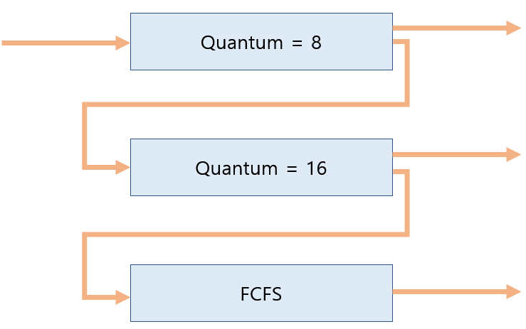

## 5) MultiLevel Queue
> Ready Queue를 여러 개로 분할
- **Foreground(Interactive) - RR**
- **Background(batch - no human Interactive) - FCFS**
- Fixed Priority Scheduling
- Time Slice : 각 큐에 CPU Time 적절한 비율로 할당    
ex) 80% to Foreground in RR / 20% to Background in FCFS

\* 프로세스를 어느줄에 넣을 것인가?   
우선순위가 높은 거에만 주면 우선순위가 낮은프로세스는 Starvation문제가 생긴다.
==> 큐가 두개 존재 (두줄로 줄을 선다)   
각 줄마다 스케줄링 방식을 채택    

## 6) MultiLevel FeedBack Queue   
- 프로세스가 다른 큐로 이동 가능.
- **에이징(Aging)**을 이와 같은 방식으로 구현할 수 있다.
- MultiLevel-FeedBack-Queue Scheduler를 정의하는 파라미터들
  - Queue의 수
  - 각 큐의 Scheduling Algorithm
  - Process를 상위 큐로 보내는 기준
  - Process를 하위 큐로 내쫓는 기준
  - 프로세스가 CPU 서비스를 받으려 할때, 들어갈 큐를 결정하는 기준

\* Example    

처음 들어오는 프로세스는 우선순위가 가장 높은 큐에 들어가고 RoundRobin의 할당시간을 적게 준다.   
밑에 큐로 갈수록 RoundRobin의 할당시간을 길게 준다.   
맨 아래는 FCFS로 처리.

cf) 맨위 큐에서 전부 처리 못하면 강등된다.  
결국 CPU 사용시간이 짧은 프로세스를 우대받는 방식이 된다.

## 7) Multiple-Processor Scheduling
> CPU가 여러개 있을때의 스케줄링    
CPU가 여러 개인 경우 스케줄링은 더욱 복잡해짐.
- Homogeneous Processor인 경우
  - Queue에 한 줄로 세워서 각 프로세서가 알아서 꺼내가게 할 수 있다.
  - 반드시 특정 프로세서에서 수행되어야 하는 프로세스가 있는 경우에는 문제가 더 복잡해짐.
- Load Sharing
  - 일부 프로세서에 job이 몰리지 않도록 부하를 적절히 공유하는 메커니즘이 필요.
  - 별개의 큐를 두는 방법 vs 공동 큐를 사용하는 방법
- Symmentic Multiprocessing(SMP)
  - 각 프로세서가 각자 알아서 스케줄링 결정 (= 모든 CPU가 동등)
- Asymmentic Multiprocessing
  - 하나의 프로세서가 시스템 데이터의 접근과 공유를 책임지고 나머지 프로세서는 거기에 따름.   
  (= 하나의 CPU가 나머지 CPU를 분배 )

cf) 어떤 job은 특정 CPU가 실행해야할 수도 있다. : Homogeneous processor   
ex) 미용실에서 헤어디자이너가 여러명 있을때 전담하는 헤어디자이너에게 가는 것.    

## 8) Real-Time Scheduling
> 시간 제약안에 반드시 실행 되어야하는 것. (= DeadLine이 존재)
- **Hard Real-Time Systems**    
  : 정해진 시간 안에 반드시 끝내도록 스케줄링 해야함.   
  ex) 원자력, 미사일 등 
- **Soft Real-Time Systems**  
  : 일반 프로세스에 비해 높은 Priority를 갖도록 해야함.   
  ex) 영화, 멀티미디어 등

## 9) Thread Scheduling
> 쓰레드에 따른 스케줄링

- **Local Scheduling**    
: User Level Thread의 경우 사용자 수준의 Thread Library에 의해    
어떤 Thread를 스케줄할지 결정.    
=> 사용자 프로세스 내부 어떤 쓰레드에게 줄지 결정하는 것.   
- **Global Scheduling**   
: Kernel Level Thread의 경우 일반 프로세스와 마찬가지로 커널의    
단기 스케줄러가 어떤 Thread를 스케줄할지 결정.    
=> 운영체제가 쓰레드를 알고 있기때문에 운영체제가 결정.    

## 10) Algorithm Evaluation 
- Queueing Models   
: 확률 분포로 주어지는 Arrival Rate와 Service Rate 등을 통해    
각종 Performance Index 값을 계산    
=> 굉장히 이론적인 방법 :     
계산으로 인한 방식 =>현재는 실제 시스템에서 돌려보는 방식이 더 많이 쓰임
- Implementation (구현) & Measurement(성능 측정)    
: 실제 시스템에 알고리즘을 구현하여 실제 작업(workload)에 대해    
성능을 측정 비교    
=> 실제 시스템에 구현을 해서 돌려보고 성능을 측정한다.
- Simulation(모의 실험)   
: 알고리즘을 모의 프로그램으로 작성 후 Trace를 입력으로 하여    
결과를 비교   
(trace : 시뮬레이션 프로그램에 인풋으로 들어갈 데이터.)

 

## 작성자

