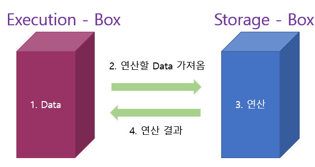
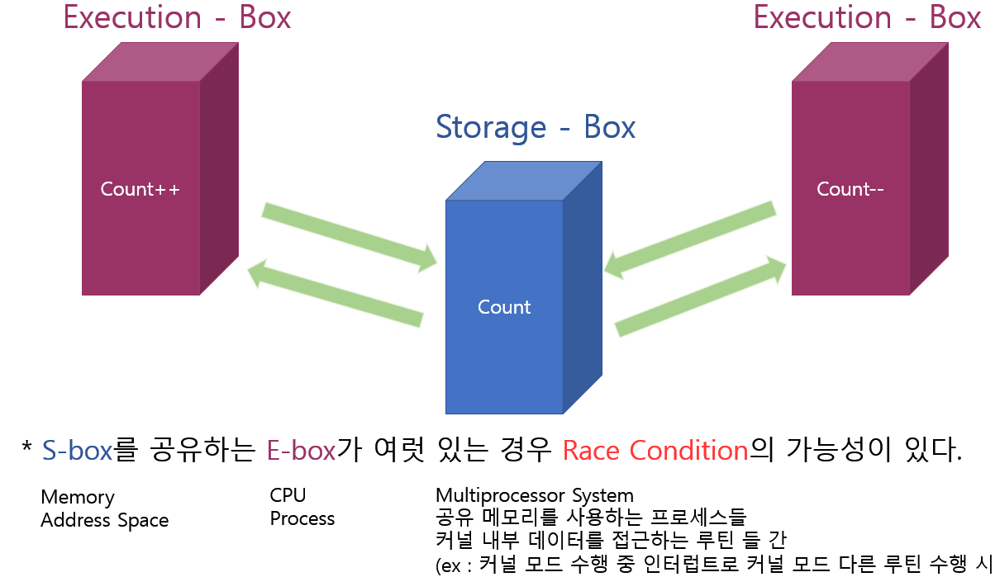
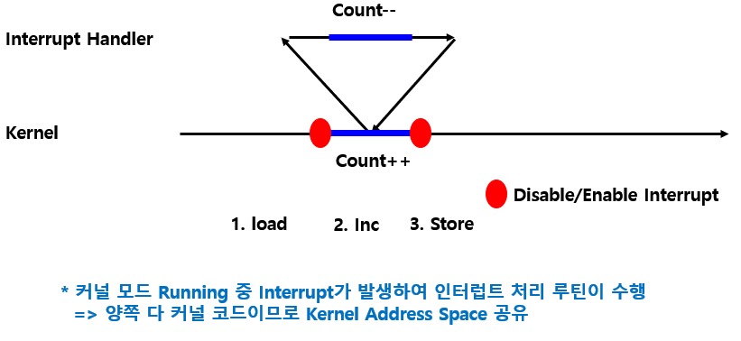
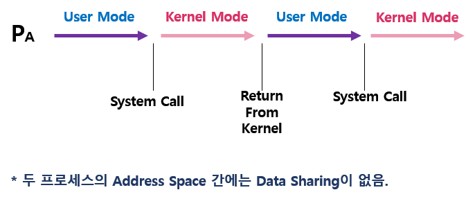
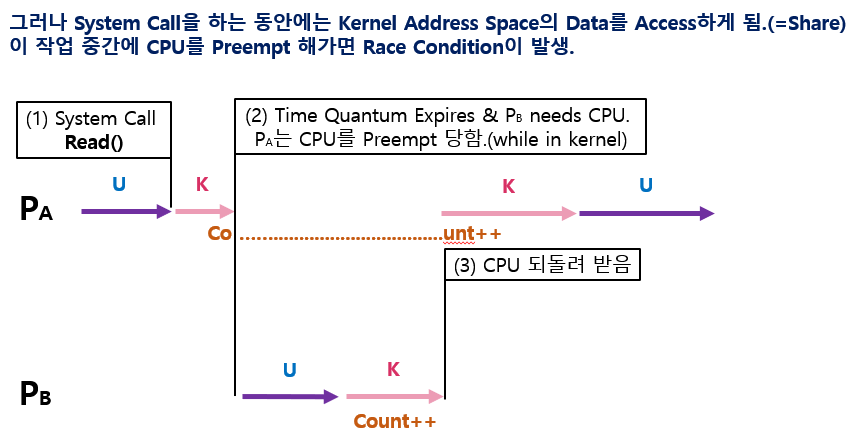
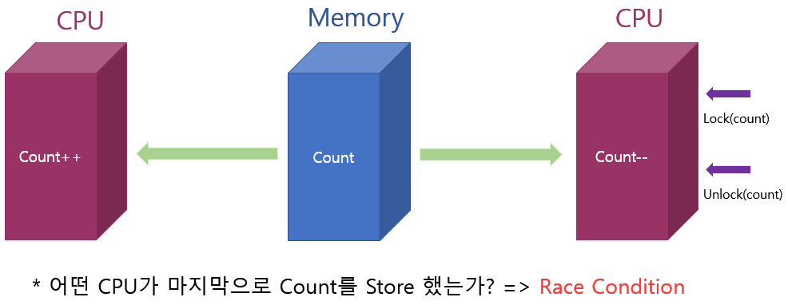
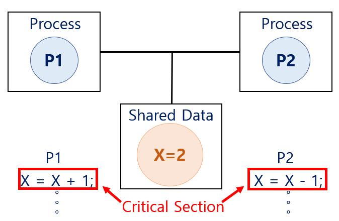

# 1. 데이터의 접근
> 데이터가 저장된 위치에서 데이터를 읽어와서 연산을 한 후, 그 결과를 저장된 위치에 다시 저장.   



\* 문제점?
데이터를 읽기만 하면 문제가 될 것이 없다.   
하지만 데이터를 읽어와서 수정을 한 후 다시 결과를 저장하는 경우에는    
언제 읽느냐에 따라 달라지는 문제가 생긴다.

# 2. Race Condition(경쟁상태)
> 여러 주체가 하나의 데이터를 동시에 접근하려고 할때 **Race Condition(경쟁상태)** 라고 한다.



count = 0일때 -> count++ -> count-- 하거나    
count-- > count++ 하면 결과 0이라고 예상    

But,    
count =0 일때,   
왼쪽에서 count(0)를 읽어와 count++ 연산을 수행하고 있을때   
오른쪽에서 count(0)를 읽어와 count-- 연산을 한다.   
왼쪽 결과를 저장 (1) 한 뒤 오른쪽 결과를 다시 저장하면 (-1)로 저장되므로 -1 한 결과만 저장되게 된다.    ==> **Syncronize 문제**

# 3. OS에서의 Race Condition은 언제 발생하는 가?
## 1) Kernel 수행 중 인터럽트 발생 시

1. load 데이터를 읽어 온 후 인터럽트 발생! Context에 Count = 0을 저장해둠.    
=> Interrupt Handler 처리 과정에서 Count-- 수행 하나 감소 Count = -1
2. 다시 되돌아와서 Context 내용을 가져옴 (Count =0)   
 => Count++ 수행 Count = 1
3. Count = 1을 저장.
=> 결국 감소 시킨 것은 반영이 되지 않고 1증가 시키는 연산만 반영이 됨!

\* 해결방법?    
먼저 하던 일을 마저 끝내고 Interrupt를 수행한다.    
결국 순서를 정해주면 해결이 가능하나 비효율적일 수 있으므로 잘 조정해야한다.    
(= 공유 자원을 건들이는 동안에는 Disable Intterupt로 막는다.)

## 2) Process가 System Call을 하여 Kernel Mode로 수행 중인데, Context Switch가 일어나는 경우
   



\* 해결방법?    
Kernel 모드 진행중 Time Quantum이 끝났지만 유보하고 Kernel 연산끝나고 User 모드로 갈때    
CPU를 뺏으면 이러한 문제를 해결 할 수있다.    

## 3) Multiprocessor에서 Shared Memory 내의 Kernel Data
> Multiprocessor의 경우 Inerrupt Disable/Enable로는 해결이 되지 않는다.



\* 해결방법?
방법 1. 한번에 하나의 CPU만이 커널에 들어갈 수 있게 한다.   
방법 2. 커널 내부에 있는 각 공유 데이터에 접근할 때마다   
그 데이터에 대한 Lock/Unlock을 한다.

# 4. Process Synchronization 문제
> 공유 데이터의 동시 접근은 데이터의 불일치 문제를 발생시킬 수 있다.    
일관성 유지를 위해서는 협력 프로세스간의 실행 순서를 정해주는 메커니즘이 필요.

\* **Race Condition**   
- 여러 프로세스들이 동시에 공유 데이터를 접근하는 상황.
- 데이터의 최종 연산 결과는 마지막에 그 데이터를 다룬 프로세스에 따라 달라짐.

=> ***Race Condition을 막기 위해서는 Concurrent Process는 동기화가 되어야한다.***   
***(= Synchronize)***

# 5. Critical-Sectoin Problem
> n개의 프로세스가 공유 데이터를 동시에 사용하기를 원하는 경우,   
각 프로세스의 code segment에는 공유 데이터를 접근하는 코드인 **Critcal Section**이 존재.    
공유 데이터를 접근하는 구역(코드)을 Critical-Section( 임계영역 )이라고 한다.



**=> 하나의 프로세스가 Critical Section에 있을 때 다른 모든 프로세스는 Critical Section에 들어갈 수 없어야한다.**

\* 해결방법?
- 두 개의 프로세스가 있다고 가정 P0, P1
```C
do{
  entry section // => lock
  
  Critical Section

  exit Section // => unlock
  
  remainder section
}while(1);
```
프로세스들은 수행의 동기화를 위해 몇몇 변수를 공유할 수 있다.   
=> **Synchronization Variable**

# 6. 프로그램적 해결법의 충족 조건
1. **Mutual Exclusion( 상호 배제 )**
  - 프로세스 Pi가 Critical Section 부분을 수행 중이면 다른 모든 프로세스들은 그들의 Critical Section에 들어가면 안된다.
2. **Progress( 진행 )**
  - 아무도 Critical Section에 있지 않은 상태에서 Critical Section에 들어가고자 하는 프로세스가 있으면 Critical Section에 들어가게 해줘야한다.
3. **Bounded Waiting( 유한 대기 )**
  - 프로세스가 Critical Section에 들어가려고 요청한 후부터 그 요청이 허용될 때까지 다른 프로세스들이 Critical Section에 들어가는 횟수에 한계가 있어야 한다. (= Starvation이 생기면 안된다.)

# 7. SW적으로 lock을 설정하는 방법
## 1) Algorithm-1
```C
//Synchronization Variable
int turn;
initially turn = 0; // Pi는 turn==i 일때 critical section 들어갈 수 있음.

/* Process 0 */

do{
  while(turn != 0); /* My turn? */
  Critical Section
  turn = 1;       /* Now It's your turn */
  remainder section
}while(1);
```
=> 순서를 정해주는 turn을 사용.   
turn이 0이될때까지 대기...    
turn이 0이 되면 critical section으로 들어간 뒤    
turn을 1로 만들어줌.    

\* 문제점 :  Mutual Exclusion은 만족하지만 Progress 조건을 만족 하지 못함.   
과잉양보 : 반드시 한 번씩 교대로 들어가야만 함 (Swap-turn)    
상대가 turn 을 내 값으로 바꿔줘야만 내가 들어갈 수 있음.    
특정 프로세스가 더 빈번하게 Critical Section에 들어가야한다면 문제가 생김.

ex) 극단적인 예로,    
하나는 계속해서 접근을 원하는 프로세스(P0)고 하나는 딱 한 번만 접근하는 프로세스(P1)라면
P0도 결국 P1에서 바꿔주지 않으면 접근을 하지 못하게 됨.

## 2) Algorithm-2
> Turn을 교대로 쓰는 Algorithm-1을 보완

```C
//Synchronization Variable
boolean flag[2];
initially flag[모두]=false; /* no one is in Critical Section */

/* Process i */

do{
  flag[i] = true;   /* i Critical Section 들어갑니다! */
  while(flag[i]); /* i가 아직 안에 있는가? 그럼 wait */
  Critical Section
  flag[i] = false; /* i 이제 나갑니다~ */
  remainder section
}while(1);
```

=> 내가 Critical Section에 들어갈거다라는 표현을 flag로 표시.   
본인의 flag를 true로 만들고 상대방의 flag를 확인    
상대방이 flag true라면 대기   
아니면 Critical Section으로 들어간다.   
다시 flag false로 만든다.   

\* 문제점 : Mutual Exclusion을 만족하지만 Progress 요구조건을 만족하지 않음.    
P0이 flag를 true로 만들고 CPU 뺏김.   
P1도 flag true로 만들고 확인해보니 P0이 flag true므로 대기    
P0도 대기..   
결국 아무도 들어가지 못함.    

## 3) Algorithm-3 (Peterson's Algorithm)
> Algorithm1,Algorithm2를 조합하여 사용한 알고리즘.

```C
/* Process i */
do{
  flag[i] = true;   /* i Critical Section 들어갈게요 */
  turn = j;         /* i가 들어갔음을 표시 */
  while(flag[i] && turn == j); /* i가 아직 안에 있는가? 그럼 wait */
  Critical Section
  flag[i] = false; /* i 이제 나갑니다~ */
  remainder section
}while(1);
```
=> turn과 flag 둘다 사용.   
flag = true 만들고    
turn 상대로 해두고    
상대방의 깃발이 true이면서 상대방 턴인지 확인 => 맞다면 대기    
아니라면 Critical Section에 들어감    
flag = false로 만듬   

\* 문제점 : Mutual Exclusion 만족, Progress 만족, Bounded Waiting 만족 하지만,    
**Busy Waiting이 발생한다!**    
( = **Spin Lock** :
lock을 걸어서 상대를 못들어가게 막는다.   
누군가가 lock 걸고 Critical Section에 들어갔음.   
그 후 다른애는 CPU 잡아서 쓸데 없이 while문에서 조건 검사만 하면서 CPU와 Memory를 낭비 ) 

# 8. Synchronization HardWare
> 하드웨어적으로 Test & Modify를 Atomic하게 수행할 수 있도록 지원하는 경우 앞의 문제는 간단히 해결

```C
//Synchronization Variable
boolean lock = false;

/* Process i */

do{
  while(Test_and_Set(lock));
  Critical Section
  lock = false;
  remainder section
}while(1);
```

=> 위에서 문제가 생겼던 이유는 데이터를 읽는 것과 데이터를 쓰는 것을 하나의 Instruction으로 처리할 수 없었기 때문에 발생한 것!   
( ex. 고급언어에서 Count++ 연산 => 기계어로는 Load + Inc + Store 3단계로 구성된다.)    

읽고 쓰는 것을 한 번에 처리하는 H/W 적인 Instruction이 지원 된다면 lock 문제는 쉽게 해결 가능하다.    
Test_and_Set은 원래의 값을 읽어내고 그 자리를 1로 Setting 한다.   

cf) a가 0일때,    
Test_and_Set(a) 하면 0이 읽힌 후 a값은 1로 바뀐다.    
a가 1일때,    
Test_and_Set(a) 하면 1이 읽힌 후 a값은 1로 바뀐다.    
=> 하나의 Instruction으로 처리한다.


<br/>

## 작성자

<a href="https://github.com/jhi93"></a>