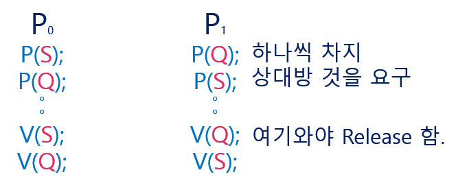
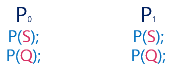

# 1. Semaphores
> 앞의 방식들을 추상화 시킨 추상 자료형.

```C
//Synchronization Variable
Semaphore S;

/* P(S) : */
while(S <= 0) do no-op;
S--;

/* V(S) : */
S++;
```

=>P연산과 V연산이 존재.   
**P연산은 값을 획득하는 과정( lock )**    
**V연산은 반납하는 과정 ( unlock )**    
=> 여기서도 Busy Waiting 문제는 존재함.

## Critical Section of n Processes
```C
//Synchronization Variable
Semaphore mutex; /* initially 1 : 1개가 CS에 들어갈 수 있다. */

/* Process Pi */
do{
  P(mutex); /* => mutex = 0 */

  Critical Section
  
  V(mutex); /* => mutex = 1 */
  remainder section
}
```
\* **Busy Waiting (=spin lock)**은 계속해서 들어갈 수 있는지 조건을 검사하면서 CPU를 낭비하지만
**Block & WakeUp (=sleep lock)**은 CPU를 낭비하지 않도록 block 시킨다.

# 2. Block / WakeUp Implementation
```C
typedef struct
{
  int value;        /* semaphore */
  struct process *L; /* process wait queue */
}semaphore;
```
- **Block** : 커널은 Block을 호출한 프로세스를 Suspend 시킴.    
이 프로세스의 PCB를 Semaphore에 대한 Wait Queue에 넣음.
- **WakeUp(P)** : Block된 프로세스 P를 WakeUp 시킴.   
이 프로세스의 PCB를 Ready Queue로 옮김.

```C
/* P(S) : */
S.value--;  /* prepare to enter */
if( S.value < 0 ) /* 0보다 작으면 못들어 간다. */
{
  add this process to S.L;
  block();    // 대기 큐에 넣는다.
}

/* V(S) : */
S.value++;
if( S.value <= 0 )
{
  remove a process P from S.L;
  wakeup(P);  // 레디 큐에 넣는다.
} 
```
=> 세마포어를 쓰면서 이미 누군가가 자원을 획득했다면    
**Busy Waiting하는 것이 아니라 Block - WakeUp 방식을 채택한다.**    
정리) P연산으로 접근하려고 했으나 이미 누가 획득중이다..   
blcok되고 자원을 가지고 있는 프로세스가 V연산을 하면    
block 된 프로세스중 하나를 깨운다.    

cf) 자원의 여분에 따라 구분   
자원이 2개일때는 Mutex 역할을 할 수 있고 그 이상이면 자원의 개수를 셀 수 있는 역할도 함.

# 3. Busy Waiting VS Block/WakeUp
-Critical Section의 길이가 긴 경우 - Block/WakeUp이 적당
-Critical Section의 길이가 매우 짧은 경우 - Block/WakeUp 오버헤드가 Busy Wait 오버헤드보다 더 커질 수 있음.
=> 일반적으로는 Block/WakeUp 방식이 더 좋다.

# 4. Semaphore의 종류
1. **Counting Semaphore**
  - **도메인이 0 이상인 임의의 정수 값**
  - **주로 Resource Counting에 사용**
2. **Binary Semaphore**
  - **0 또는 1 값만 가질 수 있는 semaphore**
  - **주로 Mutual Exclusion (lock/unlock)에 사용**

cf)   
자원의 개수가 하나인 경우 Binary Semaphore 상호배제용   
자원의 개수가 여러 개일때 Counting Semaphore   

# 5. Deadlock and Starvation
**DeadLock : 둘 이상의 프로세스가 서로 상대방에 의해 충족될 수 있는 Event를 무한히 기다리는 현상.**   
**Starvation(=Indefinite blocking) : 프로세스가 suspend된 이유에 해당하는 세마포어 큐에서 빠져나갈 수 없는 현상**   

    

P0 : S 획득 Q 획득 전 CPU 뺏김    
P1 : Q 획득 S획득해야하므로 가진걸 내놓길 기다림    
=> ***서로 하나씩 획득하고 상대방이 내놓기를 기다리는 것 = Deadlock***   

\* 해결방법?    
    
=> 이와 같이 자원을 획득방법을 하나로 통일    

# 6. 식사하는 철학자 문제
    

식탁에 철학자 5명이 앉아있음.   
젓가락을 Share 오른쪽,왼쪽의 젓가락을 모두 잡아야지만 식사가 가능하다.    
왼쪽에 있는 사람이 밥먹는동안 가운데 사람은 밥을 못 먹는다.   
왼쪽 사람이 내려놓자마자 오른쪽 사람이 밥먹으면 가운데 또 못 먹게된다.    

그걸 반복하게 되면 => Starvation     
5명이 모두 왼쪽 젓가락은 든다. => Deadlock    


<br/>

## 작성자

<a href="https://github.com/jhi93"></a>