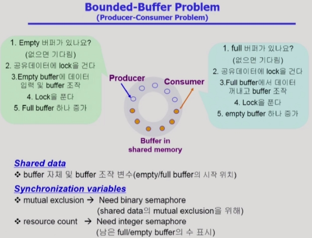
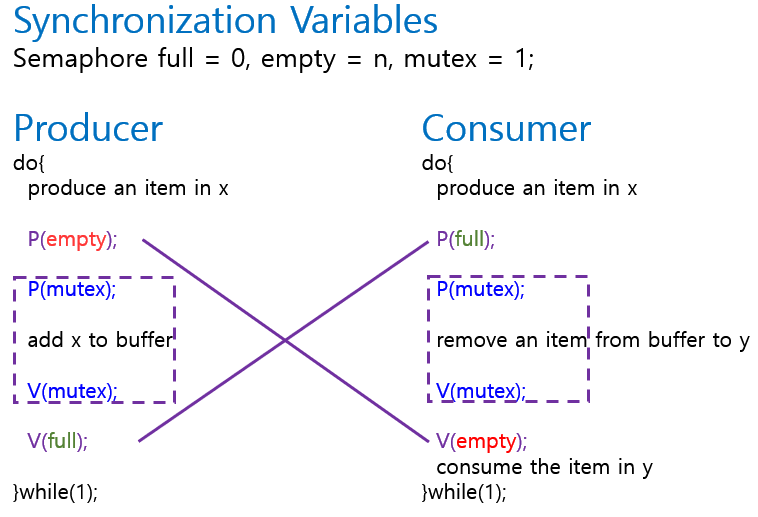
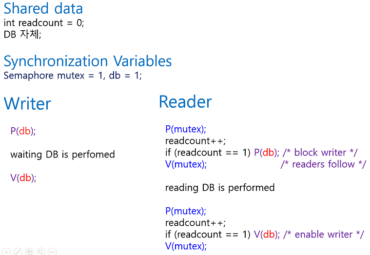
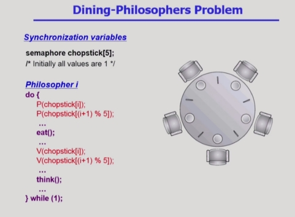
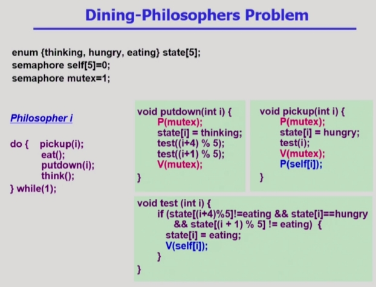

 # Process Synchronization(프로세스 동기화) = Concurrency Control(병행 제어)

# Synchronization과 관련된 고전적인 3가지 문제에 대해 알아보자!
- Bounded-Buffer ( 생산자 - 소비자 문제)
- Readers-Writers 문제
- Dining-Philosophers 문제

# 1.Bounded-Buffer 문제
- 임시로 데이터를 저장하는 공간(= Buffer)이 유한한 환경에서의 생산자-소비자 문제
- Producer 프로세스, Consumer 프로세스가 여러개 존재
- 생산자 => 공유 버퍼에 데이터를 하나 만들어서 집어 넣는 역할( ex. 주황색은 채워넣은 것)
- 소비자 => 데이터를 하나씩 꺼내 쓰는 역할

    

\* Synchronization 문제   
1. 공유 데이터와 관련된 문제
  - **생산자** : 공유 버퍼라서 생산자가 둘이 동시에 도착해서 비어있는 버퍼 하나에 둘이 동시에 데이터를 만들어 넣는 문제   
  => 해결방법 : lock을 걸어서 넣는다. 그 후 unlcok
  - **소비자** : 소비자가 동시에 하나의 버퍼를 꺼내 가는 문제   
  => 해결방법: lock을 걸어서 꺼내간다. 그 후 unlock   

2. 버퍼가 유한하다는 문제
  - **생산자** : 한꺼번에 도착해서 공유버퍼를 다 채웠음 => 소비자가 안오고 생산자가 또 옴 => 버퍼는 이미 다찼고 생산자만 도착 => 비어있는 버퍼의수 0 => 비어있는 버퍼 생길때까지 대기 (소비자가 꺼내가야 생김)
  - **소비자** : 한꺼번에 도착해서 공유버퍼 다 비움 => 생산자가 안오고 소비자가 또 옴 => 버퍼는 이미 비었고 소비자만 도착 => 채워있는 버퍼의수 0 => 채워있는 버퍼 생길때까지 대기   

\* 여기서 Semaphore를 이용해서 해야할 업무 2가지
1. 둘이 동시에 공유버퍼에 접근하는 것을 방지 하기 위해 lock을 걸어서 하나만 들어가게끔 해줘야한다.(접근시 lock 끝나면 unlock)
2. 내용이 다 비었거나 다 찼을때의 가용 자원의 수를 세어야하는 Counting Semaphore 용도도 필요함.

  

Semaphore 변수 3개    
=> 내용이 들어있는 버퍼의 개수를 세기 위한 full, 비어있는 버퍼의 개수를 세기 위한 empty, lock을 걸기위한 mutex, 

# 2.Readers- Writers 문제
- 읽는 프로세스와 쓰는 프로세스 / 공유 자원 DB 
- 읽는 작업은 여러 개가 동시에 해도 Syncronization 문제 발생하지 않고 Writer는 발생함
- Writer는 아무도 없을 때만 독점적으로 진행 / Reader는 독점 x

\* Semaphore변수 2가지 사용
1. mutex : readcount를 위한 변수(reader가 몇인지 세기 위해)
2. db : reader와 writer의 synchronization 문제를 해결하기 위해 db에 접근하는 것을 하나(reader 혹은 writer)로 두기 위한 변수   

=>Writer는 db에 lock을 걸어서 작업을 한다. 작업 끝나면 ulock.   
Reader는 쉽게 구현하면 writer와 똑같이 하면 된다.   
but 비효율적 Reader는 동시에 해도 되는데 lock 걸면 다른 Reader가 와도 못읽게 됨.    

=> readcount를 둬서 그것을 해결(reader가 몇명 읽고 있는지를 알려줌)   
최초의 Reader(아무도 읽지 않은 상태에서 처음 읽으러옴)면 db에 lock을 건다. 아니라면 readcount만 증가    
readcount도 공유변수이기에 동시에 와서 2개 증가해야하는데 1개만 증가 될 수 있으므로 mutex라는 semaphore를 둔다.   
마지막 reader (마지막으로 읽고 나가는 프로세스)라면 db unlock 해준다.   

\* 문제점?    
Reader가 도착해서 lock을 건 상태에서 Writer와 Reader가 도착하면,    
Writer는 대기하고 새로운 Reader는 그대로 db로 접근 가능   
=>Writer가 Reader들이 전부 나갈때까지 기다려야하는 문제가 생김.   
=> Writer Starvation 문제 발생 가능...    

\* 해결방법?    
일정 이상의 Reader가 들어오면 막고 들어가 있는 Reader 다 처리되면 Writer 들어갈 수 있게 끔 해준다.

# 3. 3.Dining-Philosophers 문제
> 식사하는 철학자 문제

- 5명의 철학자의 업무는 두 가지 => 1. 생각하는 일 2. 식사하는일 
- 식사할 경우 양쪽 젓가락을 가지고 식사를 한다. 
- 생각할 경우 양쪽 젓가락을 놓는다. 
- 한 쪽 젓가락을 집으면 밥을 먹을 때까지 놓지 않는다. 
- 결국 젓가락이 공유 자원이라 한 쪽이라도 누군가가 사용하고 있다면 식사를 할 수 없다.

    

\* 위 코드의 문제점?
  - DeadLock 가능성이 존재.
  - 모든 철학자가 동시에 배가 고파서 왼쪽 젓가락을 집어버린 경우

\* 해결방안
  - 4명의 철학자만이 테이블에 동시에 앉을 수 있도록 한다.
  - 젓가락을 두 개 모두 집을 수 있을 때에만 젓가락을 집을 수 있게 한다.
  - 비대칭 : 짝수(홀수) 철학자는 왼쪽(오른쪽) 젓가락부터 집도록.

  

=> 설명   
\* 공유 변수   
state[5] : 철학자의 상태 ( 생각, 배고픔, 먹는다)    

\* Semaphore 변수 2개   
self[5] : self[1] = 0 일 경우 - 1   
철학자가 젓가락 2개를 전부 집을 수 있는 권한이 없다는 것을 의미      
mutex : 5명의 상태를 바꾸는 것 (옆의 철학자의 상태도 바꿀 수 있기 때문)   

\* 그외
hungry : 젓가락을 집으려고 할때 상태       
test함수 : 두 개다 집을 수 있는지 확인    
-> 내가 배고픈 상태고 양쪽이 밥을 먹고 있지 않을때 밥먹을 수 있다.

 

## 작성자

