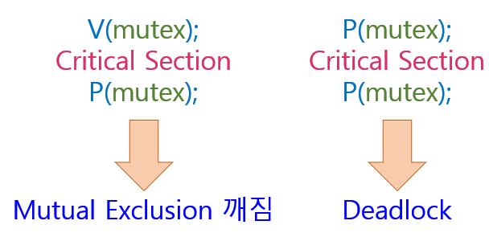
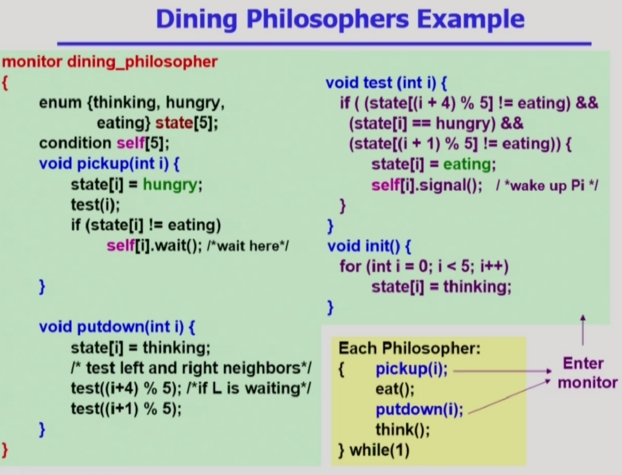

# Monitor
> 동시 수행중인 프로세스 사이에서 Abstract Data Type의 안전한 공유를 보장하기 위한 High-Level-Synchronization Construct

## Semaphore의 문제점
- 코딩하기 어렵다.
- 정확성의 입증이 어렵다.
- 자발적 협력이 필요하다.
- 한번의 실수가 모든 시스템에 치명적 영향.
 

=> Semaphore의 단점 : 프로그래머 실수시 치명적  
Monitor?    
**프로그래밍 언어 차원에서 동시접근과 관련된 문제를 모니터가 자동으로 해결해줌.**   
프로그래머의 부담을 줄여준다.   
접근하는 코드를 모니터안에 정의하고   
공유데이터를 접근하려고 한다면 모니터 내부 코드로만 접근가능하게 만들면
동시에 접근하게 될 경우 모니터가 자동으로 막아줌.     
=> 프로그래머가 lock 걸 필요가 없다.

```C
monitor monitor-name
{
  //shared variable declarations
  procedure body P1(...){
    ...
  }
  procedure body P2(...){
    ...
  }
  procedure body Pn(...){

  }
  {
    initialization code
  }
}
```
=> Semaphore와 다르게 Monitor에 대한 동시접근을 허락하지 않기때문에 프로그래머가 lock을 걸 필요가 없다.   
공유변수를 Monitor 내부에 선언하고 공유변수에 접근하는 Procedure 함수들 내부에 정의   
Semaphore에서와 마찬가지로 자원의 개수를 세는 것은 필요하다.

## Monitor 사용방법
- Condition Variable 사용   
  ex. condition x,y;    
- 어떠한 조건을 만족하지 못해서 오래 기다려야할 때 그 프로세스를 잠들게 하기 위한 용도
- Condition Variable은 Wait, Signal 연산에 의해서만 접근 가능
  - **x.wait();**
    - x.wait()을 invoke한 프로세스는 다른 프로세스가 x.signal()을 invoke 하기 전까지 Suspend 된다.
  - **x.signal();**
    - x.signal()은 정확하게 하나의 Suspend된 프로세스를 resume한다.
    - Suspend된 프로세스가 없으면 아무 일도 일어나지 않는다.

\* 정리 :    
**x.wait()** : x라는 조건을 만족하지 못해서 잠들게 함. => x라는 곳에 줄서서 서있음.   
**x.signal()** : 누군가가 x라는 조건을 다쓰고 나갔을 때 잠들어 있는 프로세스가 있으면 그 중 하나를 깨워준다.    

## Bounded-Buffer 문제
```C
monitor bounded_buffer
{
  int buffer[N];
  condition full, empty;
  /* condition var.은 값을 가지지 않고 자신의 큐에 프로세스를
  매달아서 sleep 시키거나 큐에서 프로세스를 깨우는 역할만 함 */

  void produce(int x)
  {
    // if there is no empty buffer
    empty.wait();
    // add x to an empty buffer
    full.signal();
  }

  void consume(int *x)
  {
    // if there is no full buffer
    full.wait();
    // remove an item from buffer and store it to *x
    empty.signal();
  }
}
```
=> 설명 :   
buffer : 공유 버퍼     
full : 내용이 들어있는 버퍼를 기다리면서 잠듬   
empty : 내용이 빈 버퍼를 기다리면서 잠듬    




<br/>

## 작성자

<a href="https://github.com/jhi93"></a>